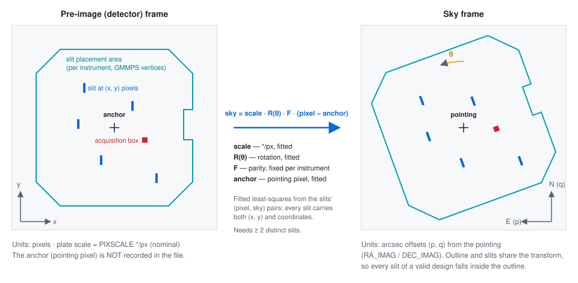
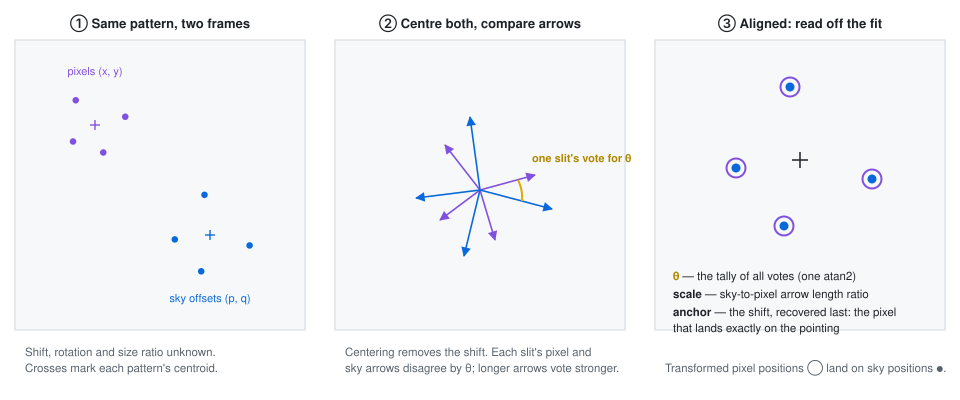
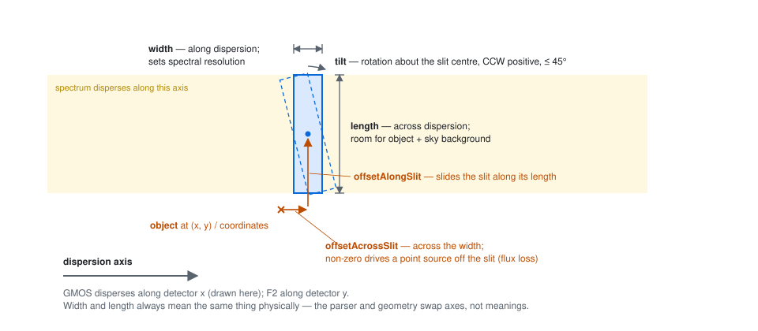
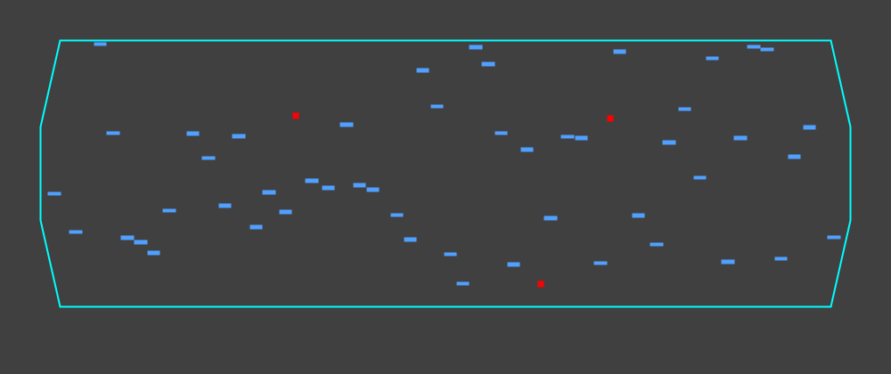
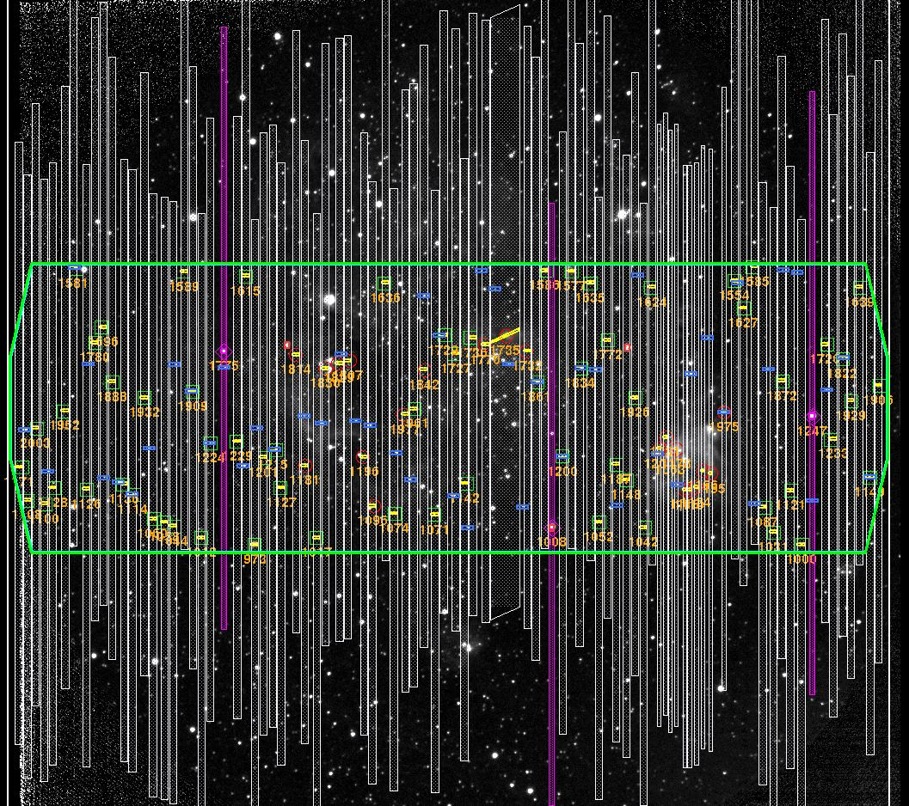
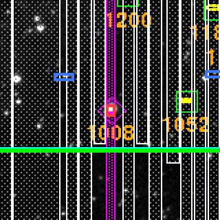

# MOS mask geometry: how the design's values become shapes

A MOS mask design (ODF/MDF) describes its apertures in the **pre-image's pixel frame**: each
slit records the pixel position of its target object plus the slit's dimensions and
displacements in arcseconds. The file carries *no WCS* — no reference pixel, no rotation
matrix — because GMMPS only ever overlays the design on the pre-image it came from. To draw a
mask on the sky, `MosMaskGeometry` recovers the missing detector→sky transform from the design
itself and applies it to both the instrument's slit placement area and every slit.

## 1 · Two frames, one fitted transform

*Figure 1 — The design lives in the pre-image's pixel frame (left). One similarity transform,
fitted from the slits themselves, maps both the placement outline and the apertures onto
pointing-relative sky offsets (right).*

## 2 · How the transform is fitted

The slit pattern is effectively drawn twice — once in pixels, once in sky offsets — and the two
drawings differ only by the transform being sought. `fitTransform` reads it off in three steps:

*Figure 2 — `fitTransform` in pictures. There is no iteration: the votes are tallied by two sums
over the slits, and the rotation, scale and anchor come out in closed form.*

## 3 · Anatomy of one slit

*Figure 3 — One aperture in the detector frame, for a horizontally-dispersing instrument. The
slit is displaced from its object by the two offsets and may be tilted about its centre.*

## 4 · Where each value enters the computation

| Value | Role in the geometry |
| --- | --- |
| `instrument` | Selects the placement-area vertices and the frame's parity `F` (fixed per instrument; GMMPS rejects pre-images in any other orientation). |
| `dispersionDirection` | Maps `width`/`length` and the two offsets onto detector x/y (GMOS: horizontal, F2: vertical). |
| `pointing` | Origin of the sky frame; all output shapes are offsets from it. |
| `coordinates` + `x`, `y` | The fit's data: each slit's position in both frames determines `scale`, `θ` and the `anchor` (least squares, ≥ 2 distinct slits). |
| `width`, `length` | Aperture extents along / across the dispersion axis. |
| `offsetAlongSlit`, `offsetAcrossSlit` | Displace the aperture from its object, in the slit's own axes. |
| `tilt` | Rotates the aperture about its centre (counter-clockwise positive, bounded to 45°). |

> **Why fit instead of reading a transform from the file?** The ODF/MDF carries no
> CRPIX/CRVAL/CD keywords — GMMPS uses the pre-image's WCS at design time and drops it when
> writing the mask. `MASK_PA` relates to the sky rotation only through instrument-special
> formulas (GMMPS's `get_OT_posangle` warns it is "not a general purpose tool"), and nothing in
> the file records the pointing pixel. The redundant (pixel, sky) pairs in the slit table
> determine all of it, with parity the only per-instrument assumption — the same one GMMPS
> itself enforces.

## 5 · Validated against GMMPS

The fitted geometry is checked against GMMPS itself, using the example designs shipped with it.
Numerically, the fitted rotation matches the pre-image WCS to a few millidegrees and GMMPS's own
`get_OT_posangle` to hundredths of a degree, and every aperture centroid lands back on its
slit's catalog sky position to within 0.22″ over the 330″ field (see `MosMaskGeometrySuite`).
Visually, mapping the computed shapes back into the pre-image pixel frame reproduces the
mask-design figure published in the GMMPS manual:

*Figure 5 — `n159_ODF.fits` (Flamingos-2) computed by `MosMaskGeometry` and de-rotated into the
detector orientation: slit placement area (cyan), science slits (blue), acquisition boxes (red).*

*Figure 6 — The same shapes overlaid on the N159 mask-design figure from the GMMPS manual
(Example 3, "Displaying the mask design"), registered using only the placement area's bounding
box; the required scale is isotropic to 0.4%. Green: our placement area over GMMPS's cyan;
blue/red: our slits. The manual's figure is the authors' own run of the example walkthrough, not
the shipped ODF, so the two designs share objects rather than being identical — where both
selected the same object, the boxes coincide.*

*Figure 7 — The one acquisition star selected in both designs: our 2″ acquisition box (red)
centred in the magenta diamond GMMPS drew.*

---

See `lucuma.core.geom.mos.MosMaskGeometry` for the implementation, `docs/mos-mask-reading.md`
for the file-reading API, and the `JtsGmosMosMaskDemo` / `JtsFlamingos2MosMaskDemo` /
`JtsGmosNorthMaskDataDemo` demos for rendered examples.
